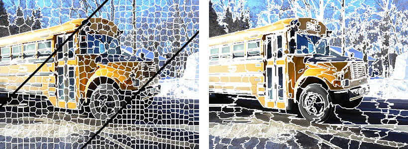

# Embedded Graph Convolutional Neural Networks

[![Build Status][build-image]][build-url]
[![Code Coverage][coverage-image]][coverage-url]
[![Requirements Status][requirements-image]][requirements-url]
[![Code Climate][code-climate-image]][code-climate-url]
[![Code Climate Issues][code-climate-issues-image]][code-climate-issues-url]

[build-image]: https://travis-ci.org/rusty1s/embedded_gcnn.svg?branch=master
[build-url]: https://travis-ci.org/rusty1s/embedded_gcnn
[coverage-image]: https://img.shields.io/codecov/c/github/rusty1s/embedded_gcnn.svg
[coverage-url]: https://codecov.io/github/rusty1s/embedded_gcnn?branch=master
[requirements-image]: https://requires.io/github/rusty1s/embedded_gcnn/requirements.svg?branch=master
[requirements-url]: https://requires.io/github/rusty1s/embedded_gcnn/requirements/?branch=master
[code-climate-image]: https://codeclimate.com/github/rusty1s/embedded_gcnn/badges/gpa.svg
[code-climate-url]: https://codeclimate.com/github/rusty1s/embedded_gcnn
[code-climate-issues-image]: https://codeclimate.com/github/rusty1s/embedded_gcnn/badges/issue_count.svg
[code-climate-issues-url]: https://codeclimate.com/github/rusty1s/embedded_gcnn/issues



This is a TensorFlow implementation of my [Graph-based Image
Classification](https://github.com/rusty1s/deep-learning/blob/master/master/main.pdf)
master thesis *(german)*.

## Requirements

To install the required python packages, run:

```bash
pip install -r requirements.txt
```

## Running tests

Install the test requirements

```bash
pip install -r requirements_test.txt
```

and run the test suite:

```bash
nosetests --nologcapture
```
